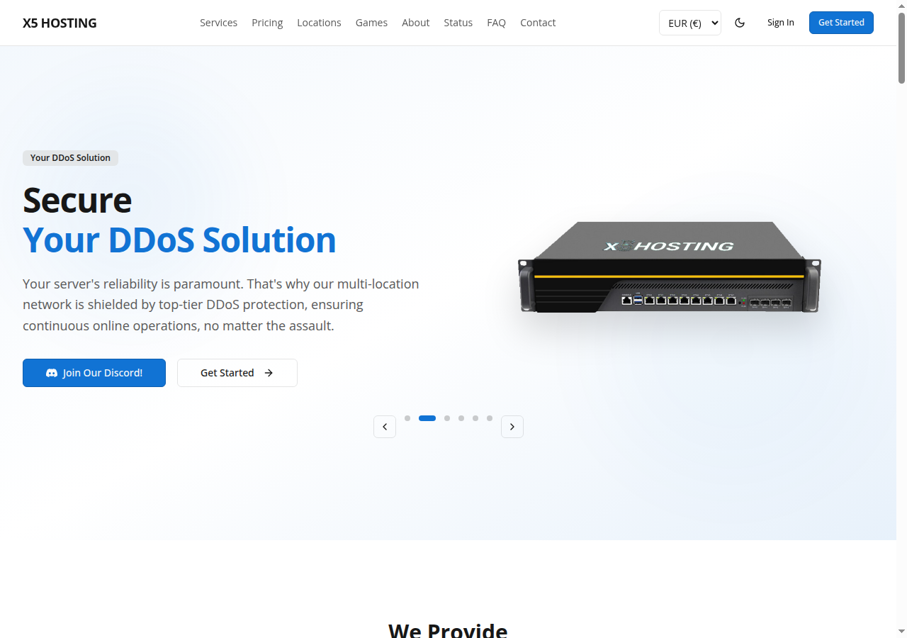
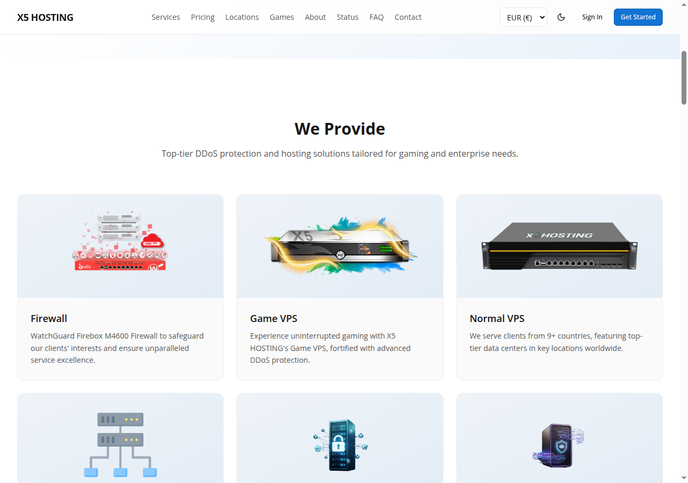
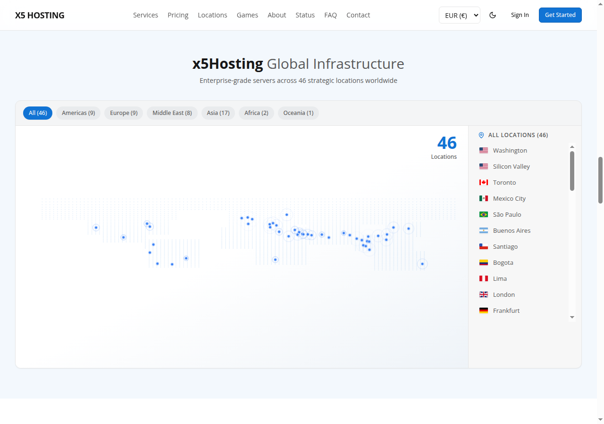
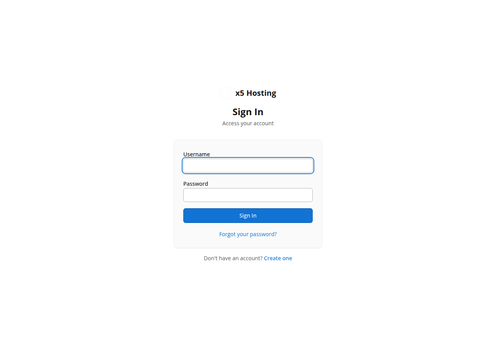
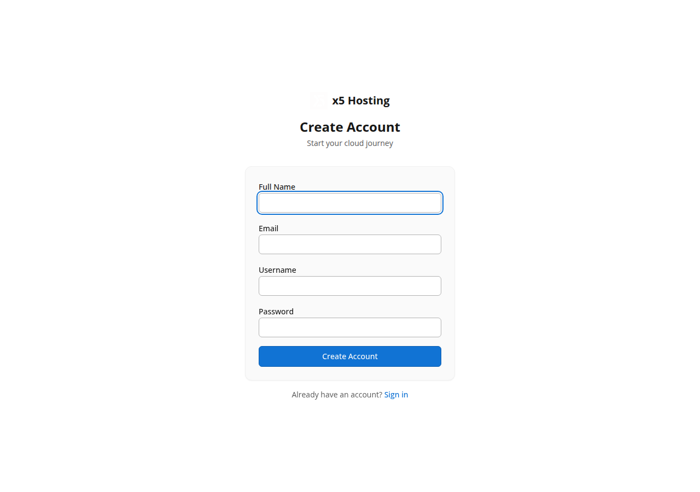
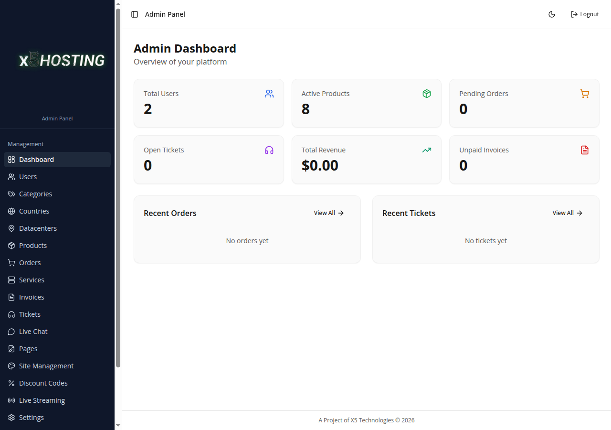
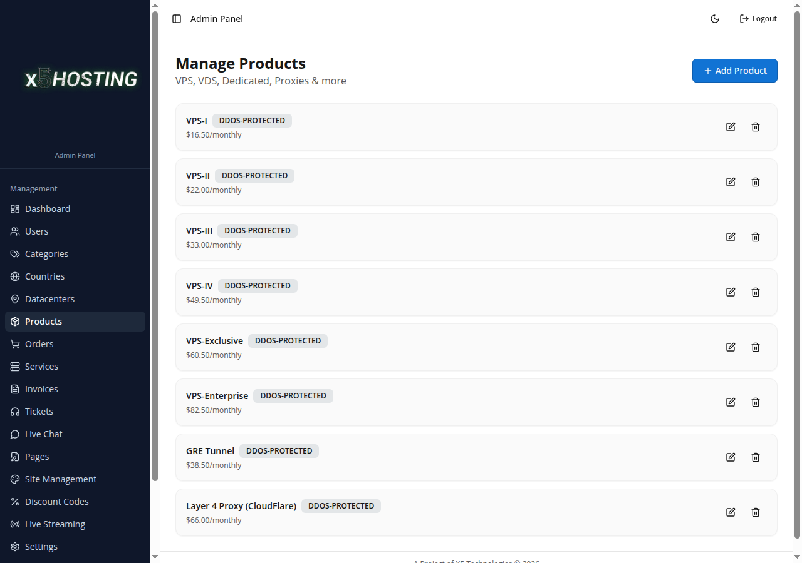
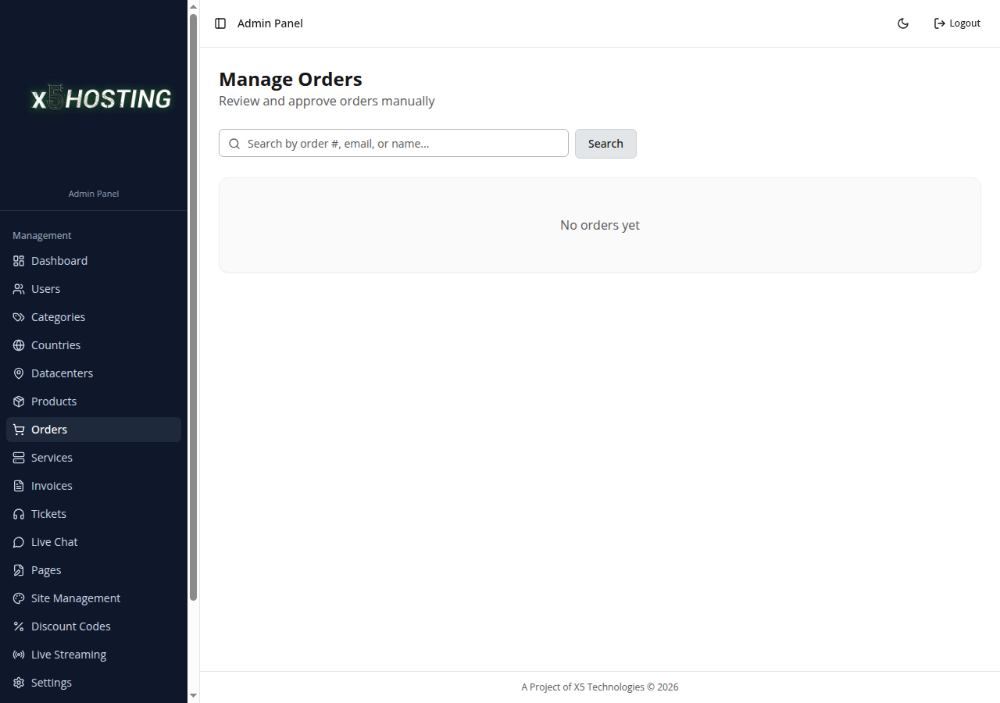

# x5Hosting - Cloud Hosting Management Panel

> A full-featured, production-grade cloud hosting management platform built entirely from scratch in Pakistan. Designed for DDoS-protected game server hosting with automated billing, manual & automated service provisioning, and real-time multi-currency support.

**Status:** Live in Production at [x5hosting.com](https://x5hosting.com)
**Type:** Custom-built SaaS Platform (Closed Source)
**Origin:** Made in Pakistan

---

## Overview

x5Hosting is a comprehensive cloud hosting panel purpose-built for managing DDoS-protected VPS, GRE Tunnels, and Layer 4 Proxy services. It features a public-facing website, a full client area, and a powerful admin panel — all developed as a single, unified platform.

Unlike off-the-shelf solutions like WHMCS or Blesta, x5Hosting was designed and coded from the ground up to meet the specific needs of game server hosting providers, with a focus on DDoS protection services, manual service provisioning workflows, and seamless integration with Pakistani payment gateways.

---

## Key Features

### Public Website
- Hero carousel with animated transitions and promotional banners
- Interactive service catalog with category-based filtering
- Real-time pricing display with automatic currency conversion
- Global datacenter locations map (9+ locations worldwide)
- Game server showcase (Rust, FiveM, Minecraft, ARK, Palworld, and more)
- DDoS protection information and technical specifications
- Partner program showcase
- CMS-powered dynamic pages
- SEO-optimized with Open Graph meta tags
- Fully responsive dark/light theme

### Client Area
- **Dashboard** — Service overview, recent activity, quick actions
- **Service Management** — View server details, credentials (with secure password toggle), IP addresses, and full allocation info
- **Live Expiry Countdown** — Real-time countdown timer showing days, hours, minutes, seconds until service expiry
- **Attack Reporting** — Submit detailed DDoS attack reports (server behavior, running services, exact timestamps)
- **Service Requests** — Request OS reinstallation, password reset, server restart/shutdown, DDoS protection upgrades/downgrades
- **Order System** — Browse products, configure services, select datacenter locations, apply discount codes, choose billing cycle
- **Invoice Management** — View all invoices, payment status tracking, automatic invoice generation
- **Support Tickets** — Create tickets by department, threaded conversations, staff replies with priority levels
- **Live Chat** — Real-time messaging between clients and support staff
- **Account Management** — Profile updates, password changes, two-factor authentication (2FA), email verification
- **Notification Center** — In-app notifications for payment confirmations, service updates, and renewal reminders
- **Multi-Currency Support** — Automatic currency detection with real-time exchange rates

### Admin Panel
- **Dashboard** — Revenue stats, user counts, active services, recent orders overview
- **User Management** — Full user list with search, role management, login activity tracking (IP, country, ISP via geolocation)
- **Product Management** — CRUD for products with multi-currency pricing (USD/EUR/GBP/PKR/INR), feature lists, specs, price tags
- **Category Management** — Dynamic product categories (DDoS Protected, Normal, Offshore, Anonymous) with custom icons and sorting
- **Datacenter Management** — Manage datacenter locations per category with country flags and datacenter-specific pricing
- **Order Management** — Order verification workflow, search by order number/email/name, manual approval/rejection
- **Service Management** — Full service lifecycle management with:
  - Server credential allocation (IP, port, username, password, OS)
  - Configuration presets (VPS, GRE Tunnel, Proxy)
  - Custom field support for any server detail
  - Manual service assignment to users by email
  - Service expiry extension (quick 30/60/90/365 day buttons + custom date)
  - Status management (active, pending, suspended, cancelled)
  - Automatic email notification to clients when service is configured
- **Invoice Management** — View all invoices, mark as paid/unpaid, payment tracking
- **Ticket System** — Manage support tickets, staff replies, priority and department routing
- **Live Chat** — Real-time admin-to-client chat interface
- **Discount Codes** — Create promotional codes with percentage/fixed discounts, category/product restrictions, usage limits, expiry dates
- **CMS Page Management** — Create and manage dynamic website pages
- **Country Management** — Configure supported countries with currency mapping and flag icons
- **OS Image Management** — Manage available operating system images for service provisioning
- **Product Addons** — Create add-on products with extra pricing

### Settings & Configuration
- **SMTP Configuration** — Email delivery setup with test functionality
- **PayFast Payment Gateway** — Full configuration (merchant ID, secured key, sandbox/production toggle)
- **Discord Webhooks** — Configurable per-notification-type webhook URLs (orders, tickets, registrations, attacks, service requests)
- **DDoS Protection Settings** — Protection tier configuration
- **Live Streaming** — Embedded stream management for promotional content

---

## Payment System

### PayFast Integration (Pakistani Payment Gateway)
- Integrated with **PayFast by apps.net.pk** — a Pakistan-based payment gateway
- Supports credit/debit card payments processed in PKR
- Complete payment flow:
  1. Client selects product and billing cycle
  2. System calculates price with real-time EUR-to-USD conversion via live exchange rates
  3. Secure access token obtained from PayFast API
  4. Client redirected to PayFast checkout page
  5. Payment verified via **SHA-256 validation hash** on return (cryptographic verification using `basket_id|SECURED_KEY|MERCHANT_ID|err_code`)
  6. IPN (Instant Payment Notification) handler as backup verification
  7. Invoice auto-marked as paid, order auto-approved, service auto-created
- **Anti-fraud protection**: Server-side hash verification prevents manual URL manipulation
- Sandbox and production mode support

### Manual Payment Option
- Client selects "Manual Payment" at checkout
- System automatically creates a support ticket with payment details
- Admin confirms payment on Discord and approves order manually
- Invoice and service updated accordingly

### Service Renewal via PayFast
- Clients can renew active or expired services directly from the service detail page
- Renewal creates a new order linked to the existing service (no duplicate services)
- PayFast processes renewal payment
- Service expiry automatically extended by the billing cycle duration (30/90/365 days)
- Existing service credentials and allocations preserved

---

## Multi-Currency System

- **Base Currency:** EUR (Euro)
- **Supported Currencies:** USD, EUR, GBP, PKR, INR
- **Live Exchange Rates:** Real-time rates from `frankfurter.app` and `open.er-api.com` APIs
- **1-Hour Cache:** Exchange rates cached for performance
- **Automatic Conversion:** All prices stored in EUR, displayed in user's selected currency
- **Country-Based Detection:** Currency automatically selected based on user's country preference
- **PayFast USD Processing:** EUR prices converted to USD at live rates for PayFast transactions

---

## Discord Integration

- **Webhook-based notifications** (no bot required — lightweight and reliable)
- **Per-type webhook URLs** — Configure separate Discord webhooks for:
  - New orders
  - New user registrations
  - Support tickets
  - Attack reports
  - Service requests
  - General notifications (fallback)
- **Rich embeds** with color-coded severity, field details, and action buttons
- **Admin test functionality** — Send test webhooks from settings panel

---

## Security Features

- **Session-based authentication** with secure cookie settings
- **Password hashing** using bcrypt (PHP) / scrypt (Node.js)
- **Two-Factor Authentication (2FA)** support
- **Email verification** for new accounts
- **Password reset** via secure token-based email flow
- **Login activity tracking** — Records IP address, country, and ISP for every login (via ip-api.com geolocation)
- **CSRF protection** and session fixation prevention
- **Security headers** — CSP, HSTS, X-Frame-Options, X-Content-Type-Options
- **Input sanitization** — strip_tags on all user inputs
- **Rate limiting** on authentication endpoints
- **PayFast hash verification** — SHA-256 cryptographic validation of payment callbacks
- **Suspicious activity logging**

---

## Technical Architecture

### Frontend
- **React 18** with TypeScript
- **Tailwind CSS** for responsive, utility-first styling
- **Shadcn/UI** component library
- **TanStack Query** for server state management and caching
- **Wouter** for client-side routing
- **Lucide React** icon library
- Dark/light theme with system preference detection
- Fully responsive design (mobile, tablet, desktop)

### Backend
- **PHP** (Production deployment) — Single-file API architecture (~2700 lines)
- **Node.js + Express** (Development environment)
- RESTful API design with consistent JSON responses
- Session-based authentication
- CORS and security middleware

### Database
- **MySQL** (Production) / **PostgreSQL** (Development)
- **Drizzle ORM** for type-safe database operations (development)
- Raw PDO queries optimized for production (PHP)
- JSONB columns for flexible service allocations
- UUID primary keys for all entities

### Deployment
- PHP production build deployed on shared hosting
- Static frontend assets served via Express/Apache
- Database on managed MySQL hosting
- Automatic frontend build pipeline (Vite)

---

## Service Provisioning Workflow

### Automated (PayFast Payment)
1. Client places order and pays via PayFast
2. Payment verified cryptographically (SHA-256 hash validation)
3. Order auto-approved, invoice auto-marked paid
4. Service created with `pending` status
5. Admin notified via Discord webhook
6. Admin configures server allocations (IP, credentials, OS) via admin panel
7. Client receives email with server details
8. Service status updated to `active`

### Manual (Admin Assignment)
1. Admin assigns service directly to a user by email
2. Optionally selects product, sets hostname, IP, renewal price
3. Configures server credentials using presets (VPS/GRE/Proxy) or custom fields
4. Client notified via email with full server details
5. Service created as `active` immediately

---

## Product Categories

| Category | Description | Protection Level |
|----------|-------------|-----------------|
| DDoS Protected Servers | High-performance VPS with enterprise DDoS protection | Hardware DDoS |
| Normal Servers | Standard VPS for general-purpose hosting | Basic |
| Offshore Servers | Privacy-focused hosting in DMCA-ignored locations | Standard |
| Anonymous Servers | Maximum privacy with cryptocurrency payment support | Enhanced |

---

## Global Datacenter Locations

Frankfurt, Amsterdam, New York, London, Singapore, Tokyo, Dubai, Helsinki, Stockholm — with per-datacenter pricing support.

---

## Database Schema (19+ Tables)

`users`, `products`, `product_categories`, `orders`, `invoices`, `services`, `tickets`, `ticket_messages`, `chat_messages`, `pages`, `settings`, `countries`, `datacenters`, `datacenter_prices`, `attack_reports`, `service_requests`, `login_activities`, `notifications`, `discount_codes`, `service_reminders`, `password_resets`, `email_verifications`, `os_images`, `product_addons`

---

## API Architecture (70+ Endpoints)

- **Authentication** — Login, register, logout, 2FA, email verification, password reset
- **Public** — Products, categories, countries, datacenters, exchange rates, streaming
- **Client** — Services, orders, tickets, chat, invoices, account, notifications, renewals, attack reports, service requests
- **Admin** — Full CRUD for all entities, user management, order approval, service configuration, settings, discount codes, streaming management
- **Payment** — PayFast token generation, IPN handling, payment confirmation with hash verification

---

## Screenshots

### Landing Page — Hero Section

### Services Overview

### Global Infrastructure Map (46 Locations)

### Login Page

### Registration Page

### Admin Dashboard

### Admin — Product Management

### Admin — Order Management

---

## About

This is a **closed-source, commercial project** — a fully custom-built cloud hosting management panel developed entirely from scratch.

**Developer:** Meekail Shaikh — CEO, X5 Technologies
**Company:** [X5 Technologies](https://x5hosting.com)
**Origin:** Built in Pakistan
**Purpose:** Production SaaS platform for DDoS-protected hosting services
**Status:** Live and serving customers at [x5hosting.com](https://x5hosting.com)

---

*This project is proprietary software developed by X5 Technologies. Source code is not available for public distribution.*
